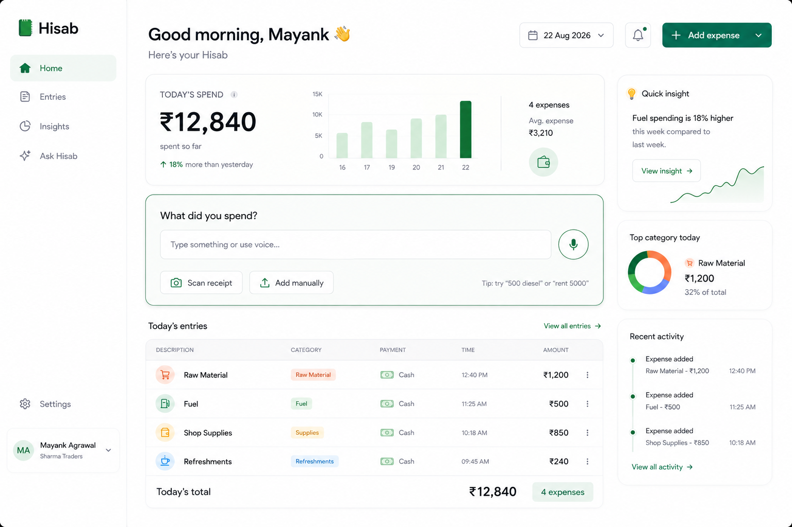
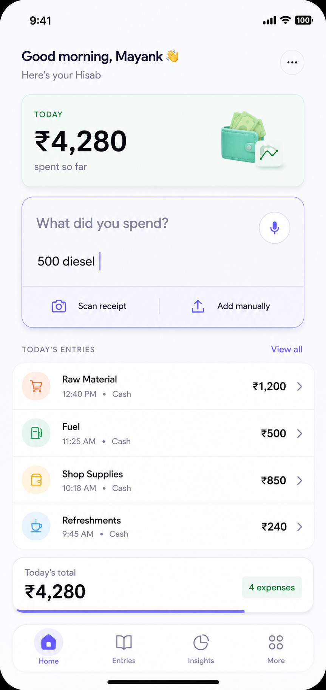
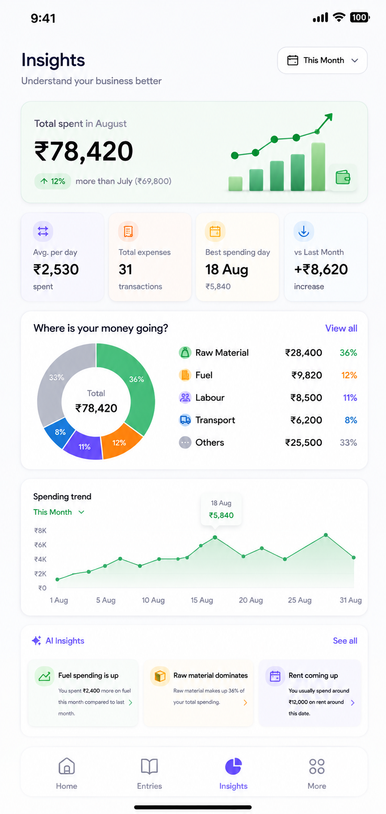
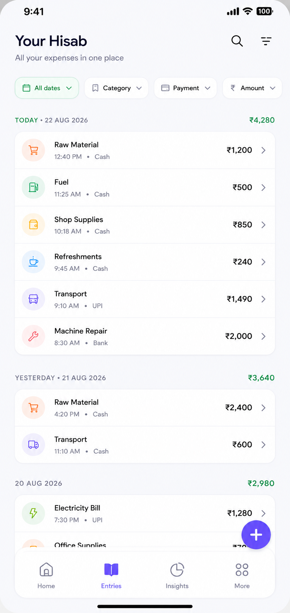
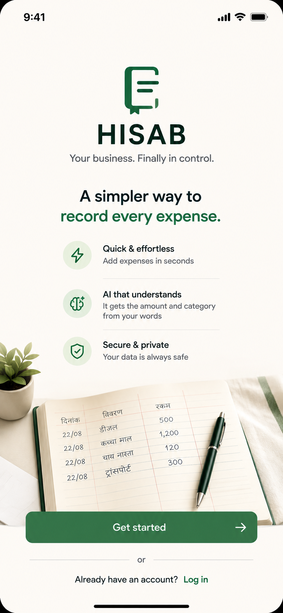
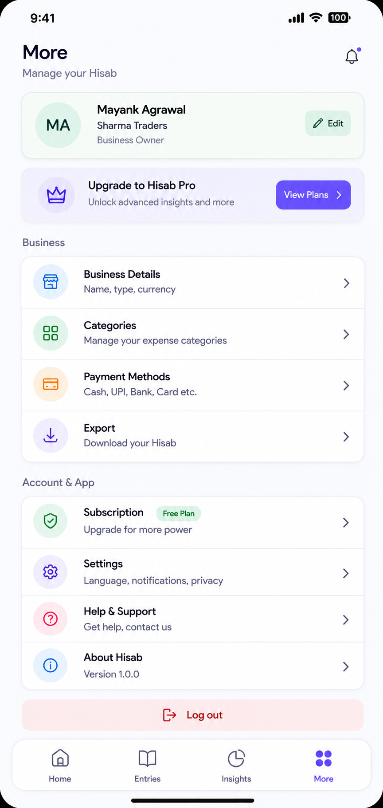
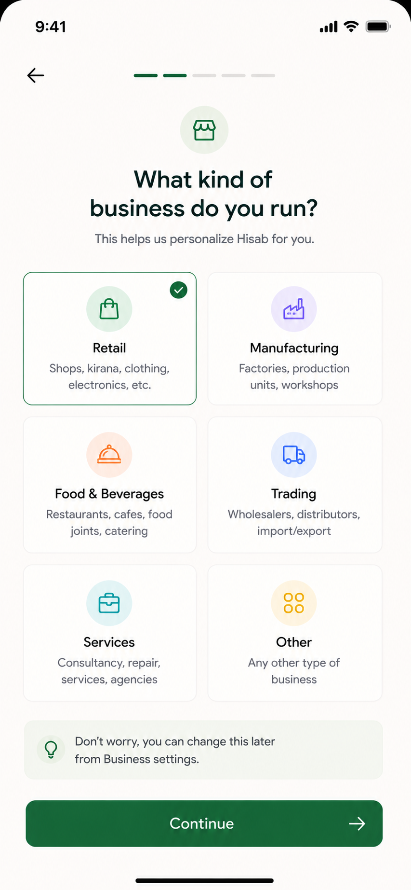
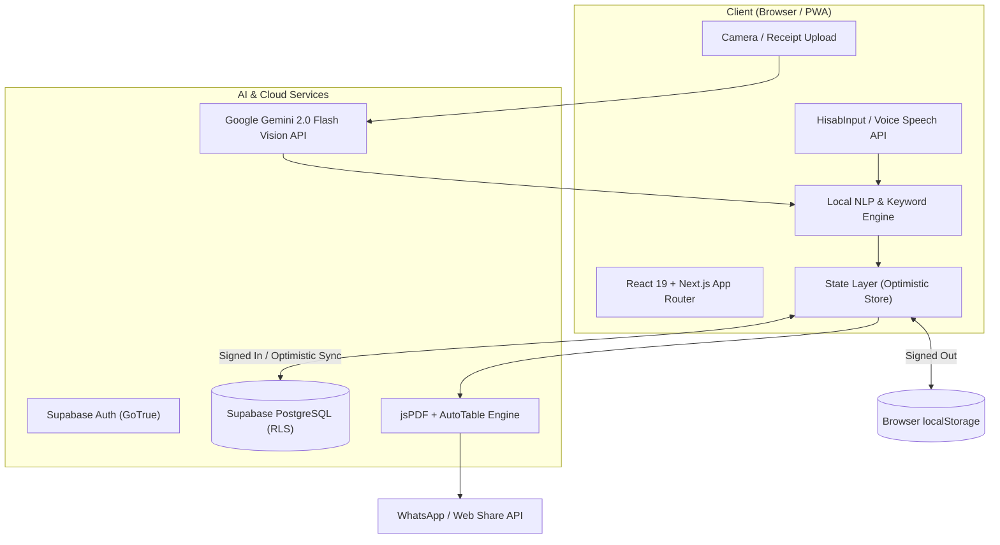

<div align="center">

  

  <p align="center">
    <strong>Your Business. Your Hisab.</strong>
    <br />
    <em>An intelligent, lightning-fast financial ledger and AI-powered expense notebook crafted for Indian small businesses, freelancers, and smart spenders.</em>
  </p>

  <p align="center">
    <a href="#-key-features"></a>
    <a href="#-tech-stack"></a>
    <a href="#-tech-stack"></a>
    <a href="#-tech-stack"></a>
    <a href="#-tech-stack"></a>
    <a href="#-tech-stack"></a>
    <a href="#license"></a>
  </p>

  <p align="center">
    <a href="#-live-ui-showcase">UI Showcase</a> •
    <a href="#-superpowers--core-features">Features</a> •
    <a href="#-architecture">Architecture</a> •
    <a href="#-nlp-engine-in-action">NLP Engine</a> •
    <a href="#-getting-started">Quickstart</a> •
    <a href="#-database--security">Security</a> •
    <a href="#-roadmap">Roadmap</a>
  </p>

  <br />

  <!-- Hero Mockup Display -->
  <a href="#-live-ui-showcase">
    
  </a>

</div>

---

## 🌟 Overview

**Hisab AI** transforms the way Indian shopkeepers, MSMEs, contractors, and individuals manage their daily cash flow and credit accounts (*Bahi-Khata*). 

Instead of tedious multi-step form entry, **Hisab** lets you type or speak naturally — like `500 diesel`, `Ramesh 500`, or `Sent 1200 to Sharma Hardware for cement` — and instantly categorizes the transaction, infers incoming vs. outgoing flow, matches contacts, and keeps running balances accurate to the paisa.

Equipped with **Google Gemini 2.0 Flash Vision AI**, Hisab also scans printed receipts, grocery slips, and **handwritten physical ledger notes**, converting them into structured accounting entries in seconds.

---

## 📱 Live UI Showcase

<div align="center">
  <table>
    <tr>
      <td width="33%" align="center">
        <strong>✨ Home & Natural Input</strong><br/><br/>
        
      </td>
      <td width="33%" align="center">
        <strong>📊 Business Insights</strong><br/><br/>
        
      </td>
      <td width="33%" align="center">
        <strong>📜 Transaction Ledger</strong><br/><br/>
        
      </td>
    </tr>
    <tr>
      <td width="33%" align="center">
        <strong>🚀 Onboarding Flow</strong><br/><br/>
        
      </td>
      <td width="33%" align="center">
        <strong>⚙️ Settings & Theme Hub</strong><br/><br/>
        
      </td>
      <td width="33%" align="center">
        <strong>💼 Personalized Setup</strong><br/><br/>
        
      </td>
    </tr>
  </table>
</div>

---

## ⚡ Superpowers & Core Features

### 🧠 1. Sub-Second Natural Language Entry (NLP)
- **Zero Friction**: Type `Chai 40`, `Salary 15000 Rahul`, or `Got 2500 from ABC Traders`.
- **Phonetic Speech Tolerance**: Built-in phonetic normalization correcting common speech-to-text mishearings (`sent ↔ saint`, `kal ↔ call`, `maal ↔ mall`).
- **Real-Time Confidence Scoring**: Dynamic chips preview amount, entity, direction (*You gave / You got*), and category before saving.

### 🎙️ 2. Native Voice-to-Hisab
- Tap the microphone and speak your transaction in Hinglish or English.
- Real-time transcription via Web Speech API with instantaneous parsing directly into the ledger.

### 👁️ 3. Multimodal Gemini 2.0 Flash Vision OCR
- **Receipt & Invoice Scanner**: Point your camera at thermal paper slips, invoices, or grocery bills.
- **Handwritten Khata Reader**: Reads handwritten dairy pages and bahi-khata notebooks.
- **Multi-Item Extraction**: Breaks down bundled receipts into categorized sub-entries with vendor association and user-provided API key quota controls.

### 📖 4. Smart Bahi-Khata Ledger Engine
- **Khata Directionality**: Strict accounting conventions — clearly monitors *"You owe"* vs. *"They owe you"*.
- **Entity Relationship Tagging**: Organize contacts by `Customer`, `Supplier`, `Employee`, `Partner`, `Freelancer`, or `Personal`.
- **Nickname & Alias System**: Attach nicknames (e.g. *"Pappu"*, *"Hardware Shop"*) so the parser always resolves the right person.
- **One-Tap Settle Up**: Seamless debt reconciliation with auto-generated settlement records.

### 📊 5. Dynamic Financial Insights & Analytics
- **Multi-Period Filters**: Filter instantly by `Today`, `This Week`, `This Month`, `Last Month`, `This Year`, or `All Time`.
- **Visual Category Donut**: Interactive breakdown of your highest spending categories.
- **Daily Spending Trend Charts**: Clean SVG visualization of daily cash flow.
- **Auto-Generated Financial Health Cards**: Contextual warnings on spike spending, highest-debt customers, and cash vs. digital split.

### 📄 6. PDF Statements & 1-Tap WhatsApp Dispatch
- **Custom-Engineered PDF Export**: Auto-formatted account statements with transaction histories, debt balance boxes, and clean rupee typography.
- **WhatsApp Direct Dispatch**: Native Web Share API integration to send PDFs or formatted ledger balances directly to party WhatsApp numbers.

### ☁️ 7. Dual-Mode Architecture & Cloud Sync
- **Signed-Out Mode**: 100% offline-ready, single-device `localStorage` persistence.
- **Signed-In Mode**: Supabase Cloud Sync with Row-Level Security (RLS), optimistic UI updates, background syncing, and automatic seed-to-cloud migration on first login.

### 🎨 8. Pastel & Sage Design System
- **Mobile-First Luxury UI**: Designed with delicate pastel tones, soft borders, clean card elevation, and tactile typography.
- **Smooth Spring Physics**: Powered by `motion` with gesture-driven swipeable sheets and tactile haptics.
- **Instant Theme Switching**: Sage (warm earthy palette) and Indigo (crisp modern palette) with zero-flash CSS variable tokens.

---

## 💡 NLP Engine in Action

The custom client-side parsing engine processes inputs in under **2 milliseconds**:

```
Input: "Sent 4500 to Sharma Hardware for cement via UPI"
│
├── 💰 Amount      : ₹4,500
├── 👤 Entity      : Sharma Hardware (matched alias: "cement supplier")
├── 🏷️ Category    : Construction / Materials (matched keyword: "cement")
├── 🔄 Direction   : Outgoing ("You gave")
├── 💳 Payment     : UPI
└── 🎯 Confidence  : 98% (Auto-suggests one-tap record)
```

| Input Sample | Detected Entity | Amount | Category | Direction |
| :--- | :--- | :--- | :--- | :--- |
| `500 diesel petrol pump` | *None* | ₹500 | Fuel & Travel | Outgoing |
| `Ramesh gave 1200 cash` | Ramesh | ₹1,200 | Income / Settlement | Incoming |
| `15000 salary to Mukesh` | Mukesh | ₹15,000 | Salaries & Wages | Outgoing |
| `Tea snacks 120` | *None* | ₹120 | Food & Dining | Outgoing |
| `Received 5000 from ABC Corp` | ABC Corp | ₹5,000 | Sales / Income | Incoming |

---

## 🏗️ System Architecture



---

## 🛠️ Tech Stack Matrix

<div align="center">
  <table>
    <thead>
      <tr>
        <th>Layer</th>
        <th>Technology</th>
        <th>Purpose</th>
      </tr>
    </thead>
    <tbody>
      <tr>
        <td><strong>Core Framework</strong></td>
        <td><a href="https://nextjs.org/">Next.js 16 (App Router)</a></td>
        <td>Turbopack-powered SSR/CSR hybrid web application</td>
      </tr>
      <tr>
        <td><strong>UI & Runtime</strong></td>
        <td><a href="https://react.dev/">React 19</a> + <a href="https://www.typescriptlang.org/">TypeScript 5</a></td>
        <td>High-performance UI state management & full type safety</td>
      </tr>
      <tr>
        <td><strong>Styling</strong></td>
        <td><a href="https://tailwindcss.com/">Tailwind CSS v4</a></td>
        <td>Utility-first styling with custom CSS variable themes</td>
      </tr>
      <tr>
        <td><strong>Animations & UX</strong></td>
        <td><a href="https://motion.dev/">Motion (Framer Motion)</a></td>
        <td>Spring physics, swipeable bottom sheets & micro-interactions</td>
      </tr>
      <tr>
        <td><strong>Artificial Intelligence</strong></td>
        <td><a href="https://ai.google.dev/">Google Gemini 2.0 Flash</a></td>
        <td>Multimodal vision OCR for receipts & handwritten ledgers</td>
      </tr>
      <tr>
        <td><strong>Backend & Database</strong></td>
        <td><a href="https://supabase.com/">Supabase (PostgreSQL)</a></td>
        <td>Auth, relational schema with foreign keys, and Row-Level Security</td>
      </tr>
      <tr>
        <td><strong>Document Generation</strong></td>
        <td><a href="https://github.com/parallax/jsPDF">jsPDF</a> + <a href="https://github.com/simonbengtsson/jsPDF-AutoTable">jspdf-autotable</a></td>
        <td>Client-side vector PDF statement generator with Rupee formatting</td>
      </tr>
      <tr>
        <td><strong>Icons</strong></td>
        <td><a href="https://lucide.dev/">Lucide React</a></td>
        <td>Clean, lightweight modern icons</td>
      </tr>
    </tbody>
  </table>
</div>

---

## 📂 Repository Structure

```
HisabAI/
├── web/
│   ├── src/
│   │   ├── app/
│   │   │   ├── (app)/                  # Main app route group (BottomNav shell)
│   │   │   │   ├── page.tsx            # Home dashboard & quick hisab entry
│   │   │   │   ├── accounts/           # Bahi-Khata ledger & party detail pages
│   │   │   │   ├── entries/            # Full date-grouped transaction history
│   │   │   │   ├── insights/           # Analytics, donuts, trends & cards
│   │   │   │   └── more/               # Settings, themes, categories, export
│   │   │   ├── api/
│   │   │   │   └── scan-receipt/       # Gemini 2.0 Flash multimodal OCR route
│   │   │   ├── login/                  # Auth portal (Sign in / Sign up)
│   │   │   └── onboarding/             # Guided setup wizard
│   │   ├── components/
│   │   │   ├── hisab/                  # Account detail, transaction row, OCR modal
│   │   │   ├── layout/                 # BottomNav, page headers, error banners
│   │   │   ├── onboarding/             # Step-by-step onboarding wizard screens
│   │   │   ├── theme/                  # Theme script, provider, & selector
│   │   │   └── ui/                     # Cards, chips, bottom sheets, icon badges
│   │   └── lib/
│   │       ├── parser.ts               # Local NLP parser & phonetic normalizer
│   │       ├── store.tsx               # Unified Dual-Mode State Provider
│   │       ├── categories.ts           # Category dictionary & keyword registry
│   │       ├── statementPdf.ts         # PDF statement engine with Rupee support
│   │       ├── whatsapp.ts             # Direct WhatsApp sharing handler
│   │       ├── selectors.ts            # Khata balance computation algorithms
│   │       └── supabase/               # SSR client, server queries, RLS mappers
│   └── public/
│       ├── Assets/                     # Brand logos, icons, & illustrations
│       └── screenshots/                # Showcase captures for web & mobile
└── UI Plan/                            # Complete product UX specifications & mockups
```

---

## 🚀 Getting Started

Follow these steps to run **Hisab AI** locally on your machine.

### 📋 Prerequisites
- **Node.js**: v18.18.0 or later (Node 20+ recommended)
- **Package Manager**: `npm`, `pnpm`, or `yarn`
- **Supabase Account** *(optional, for cloud sync)*: [supabase.com](https://supabase.com)
- **Google Gemini API Key** *(optional, for AI receipt scanning)*: [Google AI Studio](https://aistudio.google.com/)

---

### 📥 1. Clone the Repository

```bash
git clone https://github.com/Magraa/Hisab-AI.git
cd Hisab-AI/web
```

### 📦 2. Install Dependencies

```bash
npm install
```

### ⚙️ 3. Configure Environment Variables

Create a `.env.local` file in the `web` directory:

```env
# Supabase Configuration (Optional for cloud sync)
NEXT_PUBLIC_SUPABASE_URL=https://your-project.supabase.co
NEXT_PUBLIC_SUPABASE_ANON_KEY=your-supabase-anon-key

# Gemini AI Vision Key (Optional - users can also provide their own key in Settings)
GEMINI_API_KEY=your-gemini-api-key
```

> **Note**: Hisab runs **100% locally out-of-the-box** using browser `localStorage` if Supabase environment variables are omitted!

### 💻 4. Run Development Server

```bash
npm run dev
```

Open [http://localhost:3000](http://localhost:3000) (or `http://localhost:3100` if custom port is used) in your browser.

### 🏗️ 5. Build for Production

```bash
npm run build
npm run start
```

---

## 🔒 Database & Security Model

When Supabase is enabled, Hisab enforces strict **PostgreSQL Row-Level Security (RLS)**:

```sql
-- Example RLS Policy for Transactions
ALTER TABLE public.transactions ENABLE ROW LEVEL SECURITY;

CREATE POLICY "Users can only access their own transactions"
ON public.transactions
FOR ALL
USING (auth.uid() = user_id)
WITH CHECK (auth.uid() = user_id);
```

- **Zero Data Leaks**: Every entity, transaction, and profile is scoped to `auth.uid()`.
- **Encrypted Local Storage**: Client keys and offline entries remain on your hardware.
- **Client-Side Key Option**: Users can input their personal Gemini API key stored strictly in local memory.

---

## 🗺️ Roadmap

- [x] **Core MVP**: Natural language parsing, transaction feeds, and Bahi-Khata ledger.
- [x] **Supabase Sync**: Real-time cloud backup, authentication, and offline rollback.
- [x] **Gemini 2.0 Flash OCR**: Multimodal receipt and handwritten note scanner.
- [x] **Dynamic Categories**: User-customizable categories with custom keywords.
- [x] **PDF & WhatsApp**: Auto-generated statements with direct WhatsApp share.
- [ ] **PWA Offline Service Worker**: Background sync queue for zero-connectivity areas.
- [ ] **Multi-Currency Support**: International currencies beyond INR (`₹`).
- [ ] **GST Invoice Export**: One-tap monthly GST breakdown reports for Indian businesses.
- [ ] **SMS Auto-Detection**: Android companion to parse bank transactional SMS.

---

## 🤝 Contributing

Contributions make the open-source community thrive. Any contributions you make are **greatly appreciated**!

1. Fork the Project
2. Create your Feature Branch (`git checkout -b feature/AmazingFeature`)
3. Commit your Changes (`git commit -m 'feat: add some AmazingFeature'`)
4. Push to the Branch (`git push origin feature/AmazingFeature`)
5. Open a Pull Request

---

## 📄 License

Distributed under the **MIT License**. See [`LICENSE`](LICENSE) for more information.

---

<div align="center">
  <p>Crafted with ❤️ for Indian MSMEs, Freelancers, and Small Businesses.</p>
  <p><strong>Hisab AI</strong> • <em>Your business. Your Hisab.</em></p>
</div>
